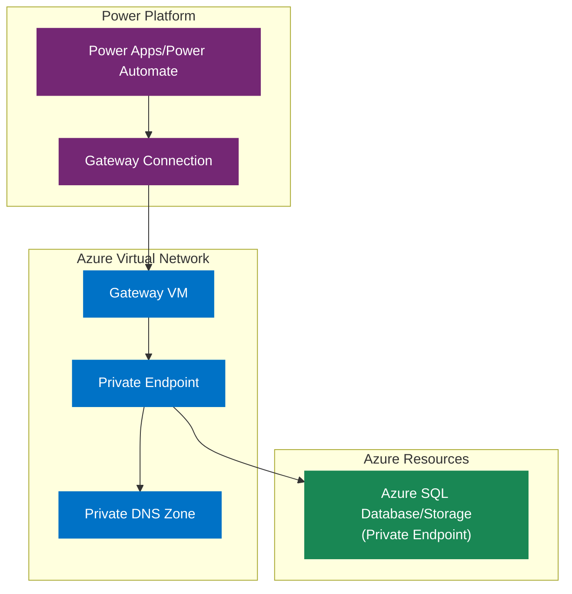
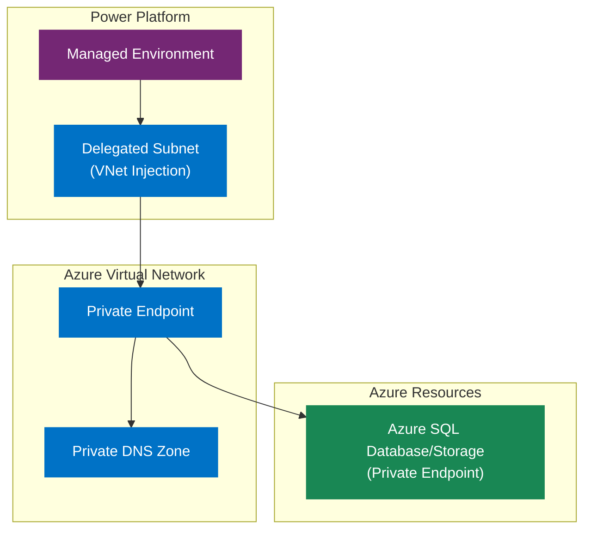
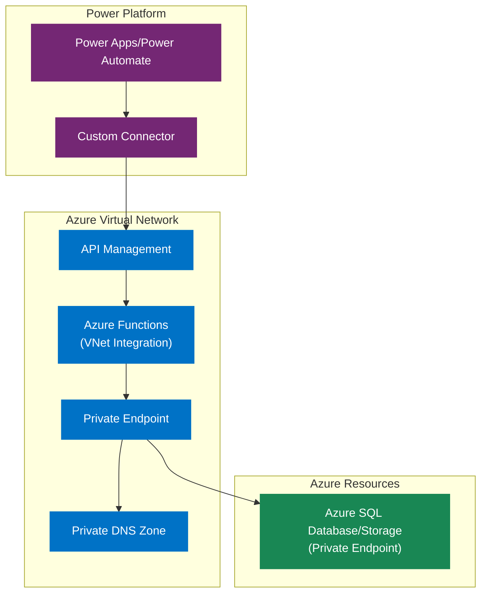
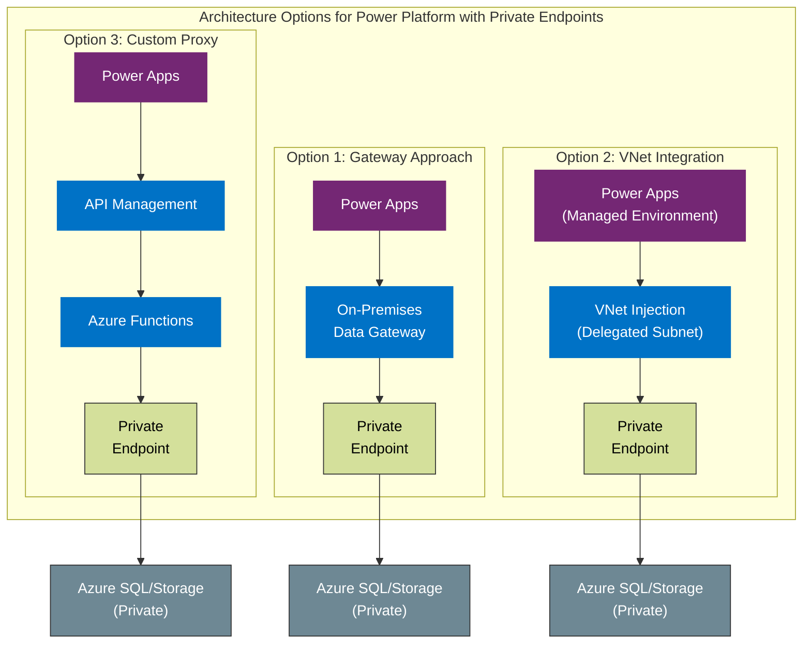

---

# Connecting Power Platform to Azure Resources via Private Endpoints

Power Platform services (Power Apps, Power Automate) typically connect to Azure resources over public endpoints. To use Azure Private Endpoints (keeping traffic private and disabling public access), you must configure your environment using one of the following approaches:

---

## Required Azure Permissions

Implementing private endpoint connections between Power Platform and Azure resources requires specific permissions:

### For All Approaches
- **Azure Resource Owner Permissions** on the target resource (SQL DB, Storage, etc.) to configure private endpoints
- **Private DNS Zone Contributor** to manage DNS entries for private endpoints
- **Network Contributor** on the VNet where private endpoints will be deployed

### For On-Premises Data Gateway
- **Virtual Machine Contributor** to deploy and manage the gateway VM
- **Resource Group Contributor** on the resource group containing the gateway

### For Power Platform VNet Integration
- **Power Platform Admin** permissions to configure Managed Environments
- **Network Contributor** on the VNet and subnet to be delegated
- Specific PowerShell modules: Az.PowerPlatform and Power Platform CLI

### For Custom Proxy Approach
- **App Service Contributor** to deploy and configure Azure Functions
- **API Management Service Contributor** to set up API Management
- **VNet Join** permissions to connect services to the VNet

---

## 1. Using an On-Premises Data Gateway

- **Deploy the Gateway**: Install the Microsoft On-Premises Data Gateway on a VM/server in the Azure VNet (or peered network) with access to the private endpoint.
- **Configure DNS**: Ensure the gateway host resolves the private endpoint's hostname to its private IP (using Azure Private DNS or custom DNS).
- **Connect via Gateway**: In Power Apps/Automate, create a connection using the gateway and provide credentials.
- **Verify Connectivity**: Test the connection; all traffic routes through the gateway, with no inbound ports required.

**Notes:**
- This is the traditional, fully supported method for private access.
- Not all connectors (e.g., Azure Blob Storage) support gateways.
- Premium connectors require appropriate Power Platform licensing.

### Special Case – Azure Blob Storage

The Azure Blob Storage connector does not support gateway connections, even though the UI might show the option. For private Blob Storage, consider:
- Using VNet integration (option 2 below), which supports the Blob connector
- Creating a custom API proxy using Azure Functions and API Management

---

## 2. Power Platform Virtual Network Integration (VNet Injection)

- **Managed Environment**: Your Power Platform environment must be a Managed Environment (premium feature).
- **Azure VNet & Subnet**: Create a VNet and a dedicated /24 subnet in the same region as your Power Platform environment, delegated to Power Platform.
- **Enterprise Policy**: Use PowerShell scripts to create and link an Enterprise Policy between your environment and the subnet.
- **DNS Configuration**: Ensure the VNet can resolve private endpoint DNS names.
- **Use Connectors**: Standard connectors now operate from within your VNet, accessing private endpoints directly.

**Setup Steps:**
1. Create the required Virtual Network(s) and subnet(s) - use at least a /24 CIDR.
2. Create a "Subnet Injection Enterprise Policy" with PowerShell scripts from Microsoft.
3. Apply the policy to your environment using PowerShell.
4. Configure proper DNS resolution for your private endpoints.
5. Use standard connectors to connect to your private resources.

**Supported Connectors:** SQL Server/Azure SQL, Azure Storage (Blob/File), Key Vault, Service Bus, Queues, Snowflake, HTTP with Azure AD, Custom Connectors, and Dataverse plugins.

**Notes:**
- More cloud-native and recommended for new deployments.
- Setup is more complex and requires admin rights and premium licenses.
- Each environment needs its own subnet.
- Regional constraints apply - the VNet must be in a region corresponding to your environment.

---

## 3. Alternative: Custom Proxy/API

- Build an Azure Function or Web API in a VNet to access the resource.
- Expose it via Azure API Management.
- Power Platform calls the API, which accesses the resource privately.

This approach:
- Gives you full control over security and implementation
- Requires more development and maintenance
- Adds extra latency and potential costs

---

## Limitations & Caveats

### On-Premises Data Gateway Limitations
- Requires a VM to maintain (patching, scaling, availability)
- Limited connector support (no Blob Storage)
- Premium licensing still required
- Adds latency to requests
- Regional considerations for optimal placement

### VNet Integration Limitations
- Requires Power Platform admin privileges and Managed Environment
- Complex setup with Azure networking and PowerShell
- Regional constraints for VNet placement
- No subnet reuse across environments
- Limited connector support for some features
- Outbound internet access considerations

### Custom Proxy Limitations
- Custom development and ongoing maintenance
- Extra latency from additional hops
- Additional costs for Azure Functions, API Management

---

## Security & Networking Considerations

- **No Public Exposure**: Private endpoints eliminate public internet exposure.
- **Authentication**: Use Azure AD authentication when possible instead of SQL logins or storage keys.
- **DNS Configuration**: Proper DNS resolution is critical for private endpoints.
- **Network Rules**: Configure NSGs to enforce least-privilege access.
- **Monitoring**: Use Azure monitoring tools to track connectivity and performance.
- **Redundancy**: For gateways, set up clusters; for VNet integration, configure paired regions.
- **Data Exfiltration Prevention**: Control outbound connectivity from your VNet.

---

## Requirements and Prerequisites

### For On-Premises Data Gateway

- Azure VM or server in the VNet with access to the private endpoint.
- Microsoft On-Premises Data Gateway installed and configured.
- Proper DNS setup for private endpoint resolution.
- Power Platform premium licenses for users (for premium connectors).
- Supported connector (e.g., SQL Server; not all connectors like Blob Storage are supported).

### For Power Platform VNet Integration

- Power Platform Managed Environment (requires admin rights and premium licenses).
- Azure subscription with permission to create VNets and subnets.
- VNet and a dedicated /24 subnet in the same region as the Power Platform environment, delegated to Power Platform.
- PowerShell scripts and permissions to create and link Enterprise Policy.
- Proper DNS configuration for private endpoint resolution.
- Supported connectors (SQL, Blob, Key Vault, etc.).

### For Custom Proxy/API Approach

- Azure Function or Web API deployed in a VNet with access to the resource.
- Azure API Management (optional, for secure exposure).
- Power Platform custom connector or HTTP action to call the API.
- Custom development and maintenance.

---

## Implementation Steps

The following outlines the high-level implementation steps for each approach. Currently, no scripts are available in the project folders, but these will be developed.

### On-Premises Data Gateway Setup

1. **Create Azure Resource with Private Endpoint**:
   ```powershell
   # Example for Azure SQL Database (to be implemented)
   # New-AzSqlServerPrivateEndpoint -ResourceGroupName "rg-name" -ServerName "sql-server" -VNetName "vnet-name" -SubnetName "subnet-name"
   ```

2. **Deploy Gateway VM**:
   - Create VM in the same VNet as the private endpoint
   - Install latest On-Premises Data Gateway
   - Register gateway with Power Platform admin center

3. **Configure Connections**:
   - Create connections in Power Apps/Power Automate
   - Select the gateway in the connection configuration
   - Test connectivity through the private endpoint

### Power Platform VNet Integration Setup

1. **Create Required Azure Resources**:
   ```powershell
   # Example VNet and Subnet setup (to be implemented)
   # New-PowerPlatformVNetResources -ResourceGroupName "rg-name" -Location "eastus" -PowerPlatformEnvironment "env-name"
   ```

2. **Configure Managed Environment**:
   - Ensure environment is a Managed Environment
   - PowerShell scripts will be created to set this up

3. **Create Enterprise Policy**:
   ```powershell
   # Example policy creation (to be implemented)
   # New-PowerPlatformEnterprisePolicy -Name "policy-name" -SubnetId "subnet-id" -EnvironmentId "env-id"
   ```

4. **Connect Services**:
   - Use standard connectors in Power Platform
   - No gateway selection required - traffic routes through VNet

### Custom Proxy Approach Setup

1. **Deploy Azure Function with VNet Integration**:
   - Create Function App with VNet integration
   - Deploy code that accesses private resources
   - Configure MSI or service principal authentication

2. **Set Up API Management**:
   - Create API Management instance
   - Import Function API
   - Configure authentication and policies

3. **Create Power Platform Custom Connector**:
   - Define the API connection in Power Platform
   - Configure authentication
   - Test connectivity

---

## Architecture Diagrams

### 1. On-Premises Data Gateway Approach

```
                                                     Azure
┌────────────────────┐         ┌──────────────────────────────────────────────┐
│                    │         │  Virtual Network                             │
│   Power Platform   │         │  ┌─────────────┐         ┌───────────────┐   │
│   ┌────────────┐   │         │  │             │         │ Private       │   │
│   │            │   │         │  │   Gateway   │         │ Endpoint      │   │
│   │ Power Apps │   │         │  │     VM      │◄────────┤               │   │
│   │            │   │         │  │             │         │               │   │
│   └────────────┘   │         │  └─────────────┘         └───────┬───────┘   │
│         ▲          │         │                                   │           │
└─────────┼──────────┘         └───────────────────────────┬──────┼───────────┘
          │                                                │      │
          │                                                ▼      │
          │                                      ┌─────────────┐  │
          │                                      │Private DNS  │  │
          │                                      │   Zone      │  │
          │                                      │             │  │
          └─────────────────────────────────────►│             │  │
                      Gateway                    └─────────────┘  │
                      Connection                                  │
                                                                  │
                                                ┌─────────────────┴───────────┐
                                                │                             │
                                                │     Azure SQL Database      │
                                                │     or Storage Account      │
                                                │    (Private Endpoint)       │
                                                │                             │
                                                └─────────────────────────────┘
```

### 2. Power Platform VNet Integration (VNet Injection)

```
                                                     Azure
┌────────────────────┐         ┌──────────────────────────────────────────────┐
│                    │         │  Virtual Network                             │
│   Power Platform   │         │                                              │
│   ┌────────────┐   │         │  ┌─────────────────────┐  ┌───────────────┐  │
│   │            │   │         │  │                     │  │ Private       │  │
│   │ Managed    │───┼─────────┼──┤  Delegated Subnet  ├──┤ Endpoint      │  │
│   │ Environment│   │         │  │  (VNet Injection)  │  │               │  │
│   └────────────┘   │         │  └─────────────────────┘  └───────┬───────┘  │
│                    │         │                                   │          │
└────────────────────┘         └───────────────────────────┬──────┼──────────┘
                                                          │      │
                                                          ▼      │
                                                ┌─────────────┐  │
                                                │Private DNS  │  │
                                                │   Zone      │  │
                                                │             │  │
                                                └─────────────┘  │
                                                                 │
                                                ┌────────────────┴──────────┐
                                                │                           │
                                                │   Azure SQL Database      │
                                                │   or Storage Account      │
                                                │  (Private Endpoint)       │
                                                │                           │
                                                └───────────────────────────┘
```

### 3. Custom Proxy/API Approach

```
                                                     Azure
┌────────────────────┐         ┌──────────────────────────────────────────────┐
│                    │         │  Virtual Network                             │
│   Power Platform   │         │                                              │
│   ┌────────────┐   │         │  ┌─────────────┐      ┌─────────────┐        │
│   │            │   │  HTTPS  │  │             │      │             │        │
│   │ Power Apps ├───┼─────────┼─►│     API     ├─────►│  Functions  │        │
│   │            │   │         │  │  Management │      │  (VNet      │        │
│   └────────────┘   │         │  │             │      │ Integration) │        │
│                    │         │  └─────────────┘      └──────┬──────┘        │
└────────────────────┘         │                              │               │
                               │                              │               │
                               │                              │               │
                               │                              ▼               │
                               │                      ┌───────────────┐       │
                               │                      │ Private       │       │
                               │                      │ Endpoint      │       │
                               │                      │               │       │
                               │                      └───────┬───────┘       │
                               │                              │               │
                               └──────────────────────────────┼───────────────┘
                                                             │
                                                ┌────────────┴──────────────┐
                                                │                           │
                                                │   Azure SQL Database      │
                                                │   or Storage Account      │
                                                │  (Private Endpoint)       │
                                                │                           │
                                                └───────────────────────────┘
```

### 4. Side-by-Side Comparison

```
                                                     Azure
┌────────────────────┐         ┌──────────────────────────────────────────────┐
│                    │         │  Virtual Network                             │
│   Power Platform   │         │                                              │
│   ┌────────────┐   │         │  ┌─────────────┐      ┌─────────────┐        │
│   │            │   │  HTTPS  │  │             │      │             │        │
│   │ Power Apps ├───┼─────────┼─►│     API     ├─────►│  Functions  │        │
│   │            │   │         │  │  Management │      │  (VNet      │        │
│   └────────────┘   │         │  │             │      │ Integration) │        │
│                    │         │  └─────────────┘      └──────┬──────┘        │
└────────────────────┘         │                              │               │
                               │                              │               │
                               │                              │               │
                               │                              ▼               │
                               │                      ┌───────────────┐       │
                               │                      │ Private       │       │
                               │                      │ Endpoint      │       │
                               │                      │               │       │
                               │                      └───────┬───────┘       │
                               │                              │               │
                               └──────────────────────────────┼───────────────┘
                                                             │
                                                ┌────────────┴──────────────┐
                                                │                           │
                                                │   Azure SQL Database      │
                                                │   or Storage Account      │
                                                │  (Private Endpoint)       │
                                                │                           │
                                                └───────────────────────────┘
```

---

## Detailed Architecture Diagrams

For a better visual representation, this repository includes Mermaid diagrams for each architecture approach. To view these diagrams:

1. **GitHub Viewing**: If viewing on GitHub, the diagrams will render automatically in the browser.

2. **Visual Studio Code**: Install the "Markdown Preview Mermaid Support" extension to view diagrams in the markdown preview.

3. **Mermaid Live Editor**: You can copy the diagram code from the `.mmd` files in the `/diagrams` directory and paste into the [Mermaid Live Editor](https://mermaid.live) to view and modify them.

4. **Export as Images**: From the Mermaid Live Editor, you can export the diagrams as PNG or SVG files if needed for presentations.

### Gateway Approach



### VNet Integration Approach



### Custom Proxy Approach



### Side-by-Side Comparison



---